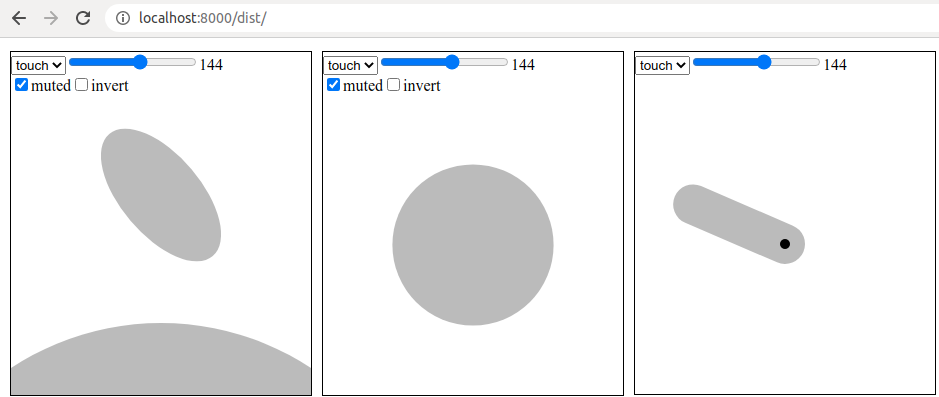

### How to run

1. In a Linux terminal:

   ```bash
   # Change directory to the root directory of this repository.
   $ cd sensors
   # Serve the javascript app (from the `dist` directory).
   $ python -m SimpleHTTPServer &
   # Serve fake readings.
   $ ./fake_readings.sh | ./stream_sensors.py --sensors=touch:/dev/stdin:readings-per-line
   ```

2. In a web browser, navigate to 
   [localhost:8000/dist](http://localhost:8000/dist). You should see


